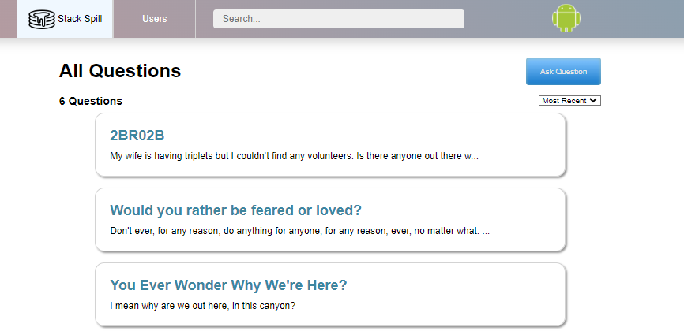
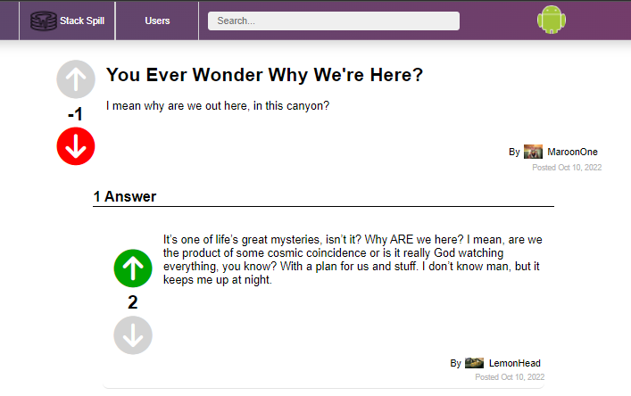
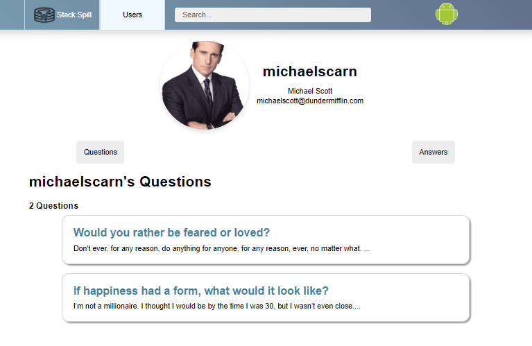

# Stack Spill

The Stack Spill is a web application designed to replicate some functionalities found in [StackOverflow](https://stackoverflow.com/).

With Stack Spill, you can sign-up, login, or sign in as a guest to try out all the features. Once inside, you'll be able to ask Questions and submit Answers to Questions submitted by other users. Be curious and share your knowledge!

Checkout the website!

### Locally
- Create an .env file and generate values for each of the following:
    - PORT
    - DB_FILE
    - JWT_SECRET
    - JWT_EXPIRES_IN
    - AWS_ACCESS_KEY_ID
    - AWS_SECRET_ACCESS_KEY

### Live Site [Stack Spill](https://stack-spill.herokuapp.com/)

# Tech

Great achievements take time and a strong foundation to construct an operating website. Here are the programs used:

- JavaScript
- CSS
- SQLite3
- Sequelize
- Express
- bcrypt.js
- CSRF.js
- React-Redux
- Heroku: Postgres
- AWS S3

## **Snapshots**
## Home Page

## Question Page

## Profile

# Features

Here are the things you can do:

- Questions
   - Ask Questions
   - Update your Question's Title and Body
   - Delete your Question
   - Sort through Questions by most recent or by alphabetical order

- Answers
   - Answer existing Questions
   - Update your existing Answer
   - Delete your Answer

- Votes
   - Create an UpVote/DownVote on existing Questions
   - Edit your UpVote/DownVote on existing Questions
   - Delete your UpVote/DownVote on existing Questions
   - Create an UpVote/DownVote on existing Answers
   - Edit your UpVote/DownVote on existing Answers
   - Delete your UpVote/DownVote on existing Answers

- Users
   - Sign Up, Login, and Demo User
   - View a User's profile
   - View the Questions a User asked
   - View the Questions a User answered

- Search
   - Look up Questions and Users to interact with other users and their Questions

# Behind The Scenes

# Future Features

There will be more, but let's have fun with what we have for now!
- [ ] Live Chat
- [ ] Text Editor
- [ ] Post comments on Answers
- [ ] Sort User Questions and User Answers
- [ ] Sort results by higher Vote count
- [ ] Bookmark Questions
- [ ] Tags
- [ ] Visible Text Count when submitting Questions and Answers
